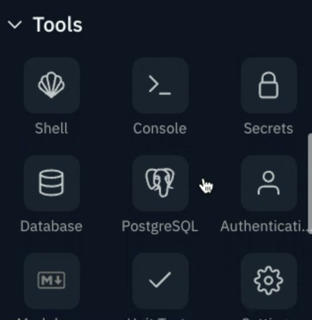
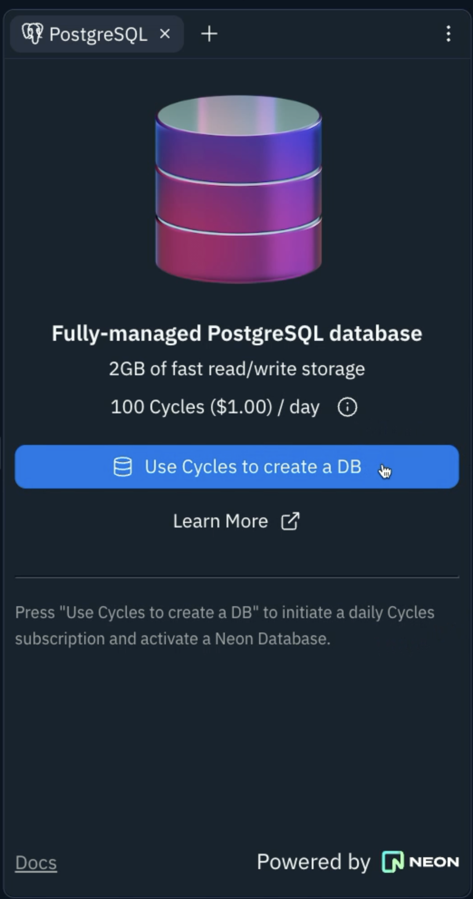
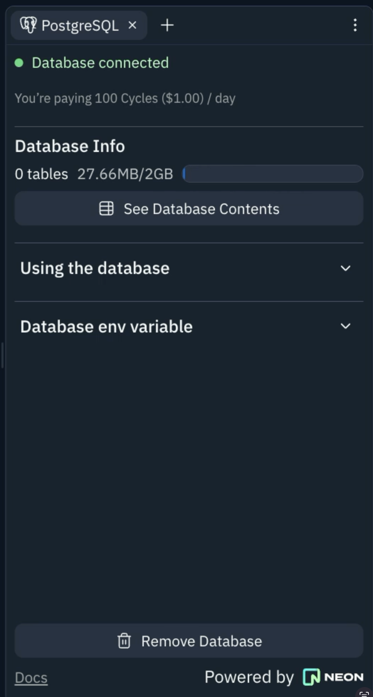
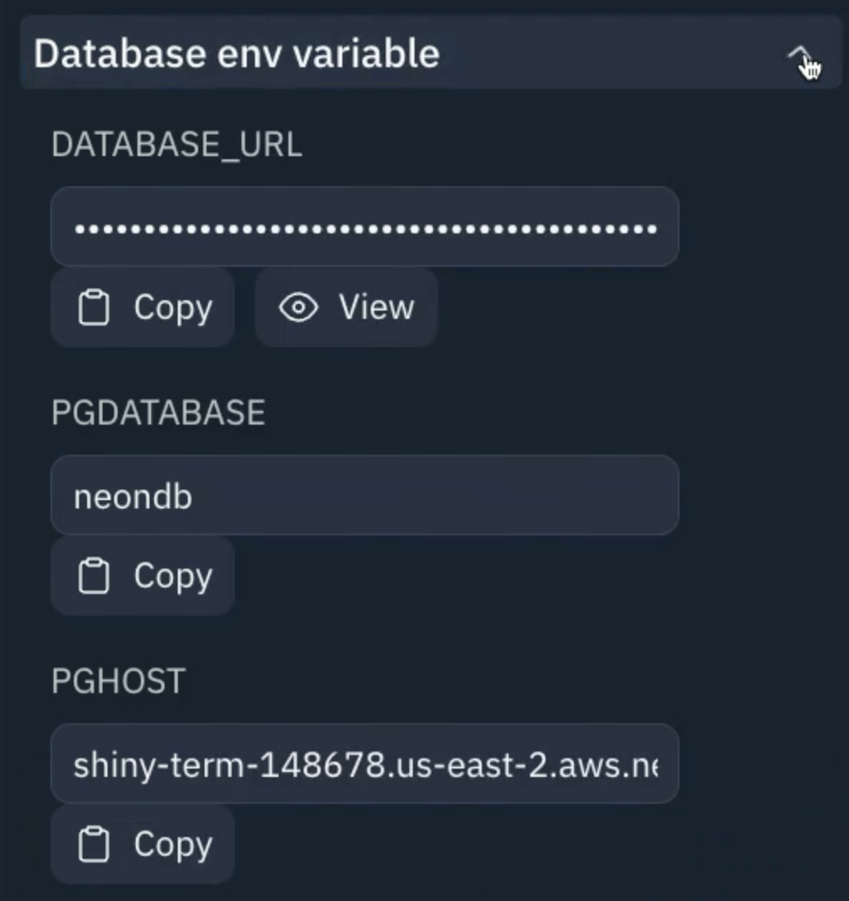
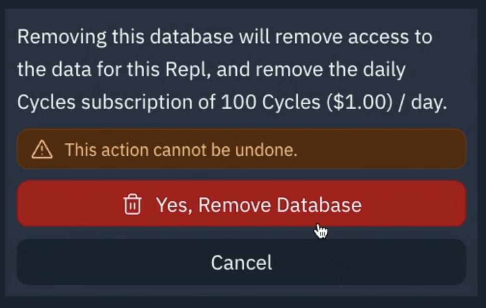

# Create your Database

## Create a New Database

From within _any_ Repl you can find your way to the **Tools** pane and select the PostgreSQL button. You can click this or drag this to a location of your choice in the workspace.

You'll be presented with this pane, an explanation and pricing of the database itself. If you want to continue, you'll need [100 Cycles a day](https://replit.com/cycles) to run the database _per Repl_. Go ahead and click **Use Cycles to create a DB** - and that's it - you've got your database!

Don't panic that we're already using a few Mb of your database. This is perfectly normal and is needed for PostgreSQL to work! This pane now lets you inspect, query, and work with the database easily.
## env Variables
One of the first things you might need is the Database env variables.

This gives you the _actual_ values for every piece of connection information you might need - but don't go copying and pasting that stuff in to your code like an _animal_. We've actually created these all as secrets, so you can connect in your code with style and safety!

## Remove Database
Should you ever decide you don't want your database anymore, then this is really easy to accomplish. Simply click that big button at the bottom that says **Remove Database**

If you're totally serious about this click **Yes, Remove Database**, but please remember that this will lose all the data in your database and definitely _cannot be undone!_

