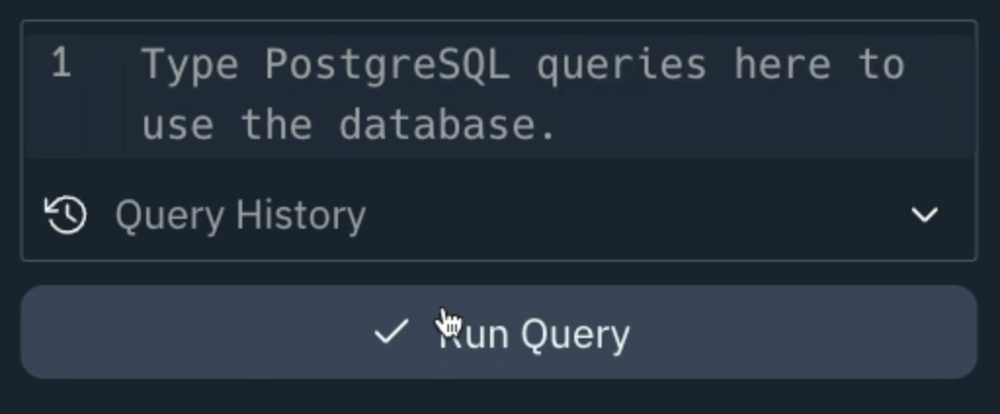
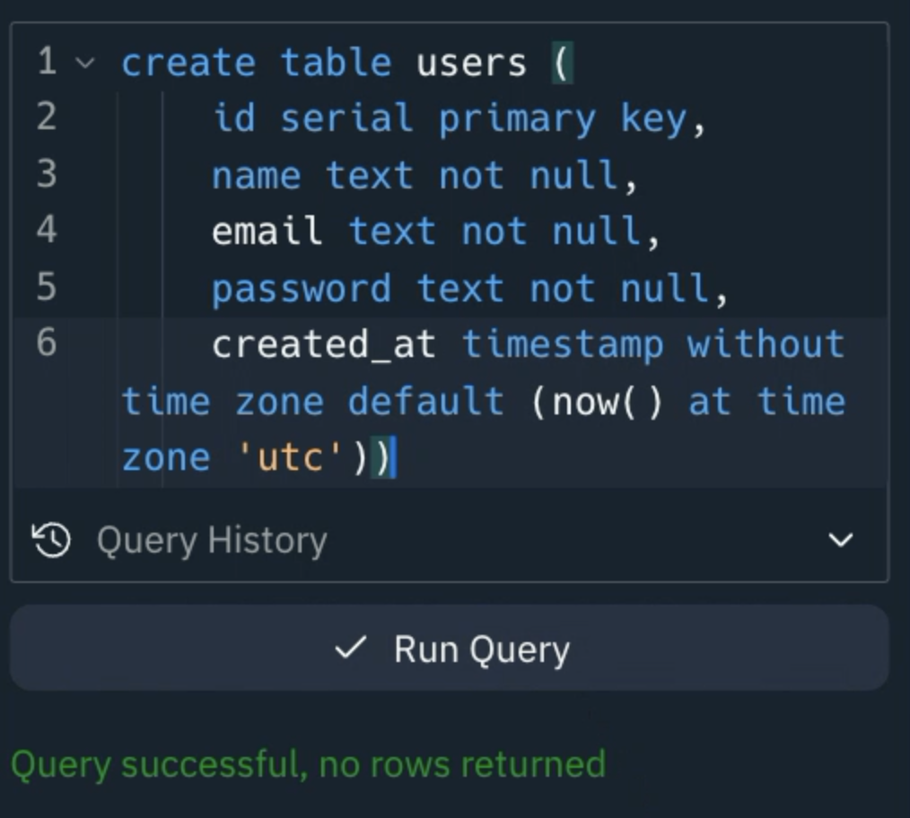
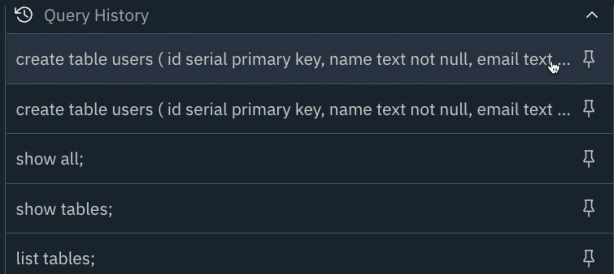
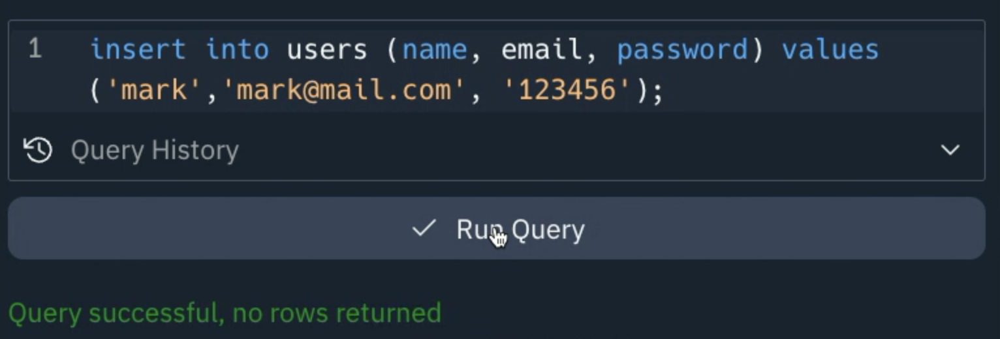

# In-tab Queries

One of the wonders of our implementation of PostgreSQL is just how much you can do from within the tab itself. Let's start by clicking **See Database Contents**

You're immediately presented with a Query builder - that even has Ghostwriter support! This means those painful days of remembering every single SQL command and syntax are now in the past!

Write your queries here and simply click **Run Query** to execute it.

In this example, we're creating a very simple user table. Nothing too fancy in this: an auto-incrementing primary key, some basic data, and a timestamp that defaults to the current millisecond in UTC. Ghostwriter is 100% the MVP here.

The best thing about the query builder IMHO (that stands for "in my humble opinion" for those of you not up on current slang 😆) is the fact you can see a history of the queries and _pin the good ones!_ No more will you have to repeat yourself with the same old queries time and time again.

We can run any kind of query directly in the tab too - take this next **insert** query as an example. We can add our data directly in the pane - no messing around with code at all!

**Don't forget:** if you end a query with a `;` then you can put as many lines of queries as you want in the query editor and run multiple commands at the same time!