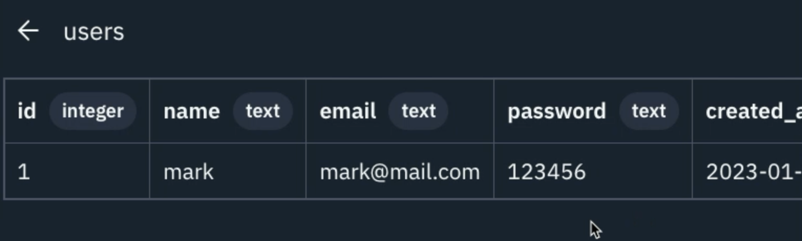
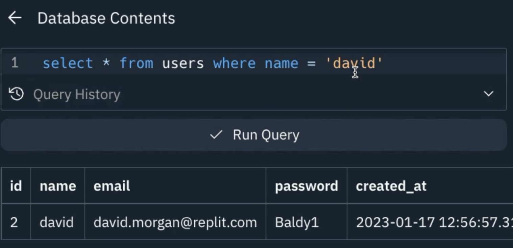

# Exploring your Data

That's where a lot of the support from other similar systems end, but one of Replit's great advantages is that we really care about our developers - so we included a data browser straight in the tab.

Click **Show All Contents** and then click on the name of the table you want to view.

Boom, there we are! You can see the contents of the table as well as some helpful information in the header about data types.

You can even use the query builder to run **select** queries of any type and see the results right there in the tab.

What more could you want?